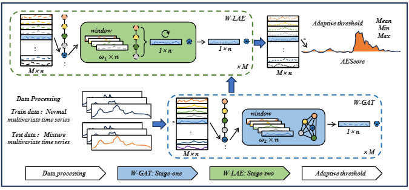

# MAD-MulW

This is the PyTorch implementation of paper MAD-MulW: A Multi-Window Anomaly Detection Framework for BGP Security Events. In this paper, we innovatively propose a stage-two window model for multivariate time series anomaly detection in order to achieve the detection and analysis of large-scale network anomalous events. The model employs a stage-one W-GAT window for feature reconstruction and a stage-two W-LAE window for time series prediction. Our proposed method outperforms baseline methods and advanced models on the BGP dataset.

📢 Miscellaneous Resources: Please check out our data-centric AI survey and awesome data-centric AI resources!

### Installation

Please ensure to use Python 3.7

`pip3 install -r requirements.txt`

### Datasets

We used part of the UCR data set and part of the BGP data set, available for download at [Link 1]() and [Link 2](), respectively.

### Quick Start

We use BGP as an example to show how to run the code. You may easily try other datasets with arguments --dataset.
First, prepare the dataset with (the generated dataset is already available in this repo)

`python3 ./data/BGP/preprocess.py`

`python3 ./data/BGP/BGPLoader.py`

After data segmentation and data collation, the model framework and training process have been set up in the model 1.py and train_model.py, finally the overall training is integrated in the file trainer.py.

MAD-MulW anomaly detection is implemented by running the run_interface.py file, which contains the above data, the model file, and show.py is used for drawing and metric evaluation.

`python3 run_interface.py`

### Multivariate Datasets Quick Start

After downloading the data, the data can be divided and sorted independently. You only need to have the same form as the BGP dataset to apply to subsequent exception detection tasks. The remaining steps are the same.
